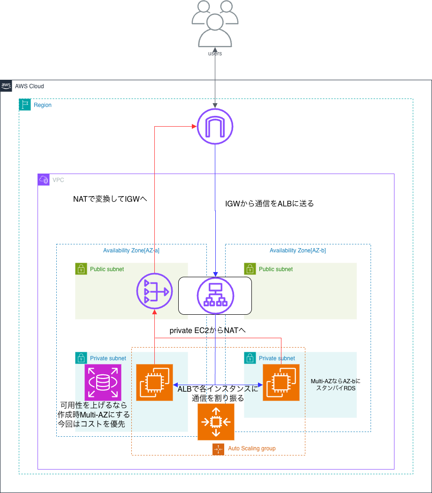

# AWS_portfolio1
## 目次

- アプリの作成理由
- 全体の解説
- セキュリティグループの設定
- 通信フロー
- NAT Gatewayを使用する理由
- 想定月額コスト
- 改善余地

# README

このインフラ構成図は「ユーザの日々の学習を記録しておく日報アプリ」を想定しております。

## アプリの作成理由

実際には勉強をしていても成長を実感するのは難しいと考え、日々勉強したことを1日の振り返りとして書き込み勉強時間も表示させれば自分がどのくらい積み上げてきたのかが可視化され、「このまま続けていこう」「ここまで続けられたからまだできる」という風に前に進み続ける手助けになるといいと思い日報アプリとしました。

## 全体の解説

ユーザごとに異なる画面を返すWebアプリケーションを想定しているため、Web層・アプリケーション層・データベース層の三層構造になっています。

可用性向上のためにEC2はAuto Scalingを利用し、複数AZにまたがるMulti-AZ構成にしており、本番想定なのでEC2はprivate subnetに配置しています。インターネットに直接アクセスせずNAT GatewayやALBを挟んでいるのでセキュリティグループの設定で最小限の通信のみを許可しています。

RDSとNAT GatewayをMulti-AZにしていないのはコストの面から今回はsingle-AZにしました。

## セキュリティグループの設定

### ALB

インバウンド通信:

80番(HTTP) from 0.0.0.0/0

443番(HTTPS) from 0.0.0.0/0

アウトバウンド通信

EC2のセキュリティグループを送信先に指定(許可)

### privateサブネット内EC2

インバウンド通信:

80番をALBのセキュリティグループからのみ許可

アウトバウンド通信:

0.0.0.0/0 全許可(セキュリティグループはステートフルなので戻りは自動許可)

### RDS

インバウンド通信:

3306番をEC2のセキュリティグループからのみ許可

アウトバウンド通信:

デフォルトで全許可ではあるが外部へ通信の予定なし

## 通信フロー

1. ユーザーがインターネット経由で Application Load Balancer にアクセス（ユーザー → IGW → ALB）
2. ALBがPrivateサブネット内の Amazon EC2 へリクエストを転送（ALB → EC2）
3. EC2が Amazon RDS に接続し、データの読み書きを実行（EC2 → RDS）

ユーザーへのレスポンスは、リクエストと同じ経路を戻るため **NAT Gatewayは使用しません。**

EC2が外部通信を行う場合に、NAT Gateway を経由してインターネットへ接続します。

---

### NAT Gatewayを使用する理由

ユーザーからのアクセスのみを想定する場合、EC2はALB経由で通信を受け取るため外部への直接通信は必須ではありません。

しかし実際の運用では、OSパッケージの更新などEC2からインターネットへ通信する必要が生じる場合があります。

そのため、Privateサブネット内のEC2が外部通信を行えるよう、NAT Gatewayを利用しています。

## 想定月額コスト（概算）

| サービス | 構成 | 月額（概算） |
| --- | --- | --- |
| EC2 | t3.micro ×2 | 約2,200円 |
| RDS | db.t3.micro（Single-AZ） | 約3,300円 |
| ALB | Application Load Balancer | 約2,700円 |
| NAT Gateway | Single-AZ | 約5,000円 |
| Internet Gateway | - | 無料 |

合計：約13,000円 / 月

※料金は東京リージョン換算の概算です。実際の料金はデータ転送量や利用状況により変動します。

## 改善余地

現在はコストを優先してRDSとNAT GatewayをSingle-AZ構成としています。

そのため、該当AZに障害が発生した場合はサービスが停止する可能性があるためシンプルではありますが、以下の2つが大きな改善点と考えています。

- RDSのMulti-AZ化
- NAT GatewayのMulti-AZ配置

これによりSPoFを排除してより高い可用性を実現できます。

改善とは少し 異なりますが、S3を活用して画像を保存できるようにすることも検討しています。

ですが日報という性質上、毎日画像を保存するとコストが増加する可能性があるので現在検討段階です。
